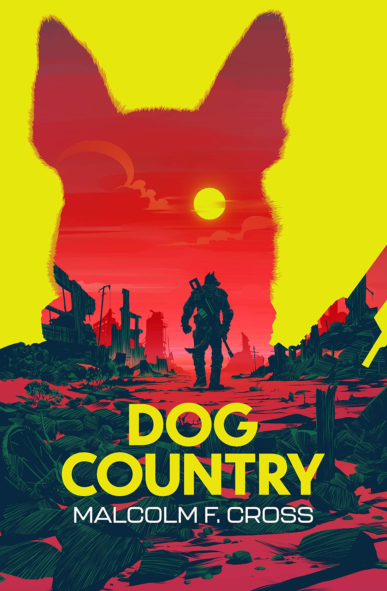

**Dog Country** is written by Malcolm F. Cross, otherwise known by his internet handle 'foozzzball', lives in London and enjoys the personal space and privacy that the city is known for. When not misdirecting tourists to nonexistent landmarks and standing on the wrong side of escalators, Malcolm is likely to be writing science fiction and fantasy. A member of the furry fandom, he won the 2012 Ursa Major Award for Best Anthropomorphic Short Fiction.

