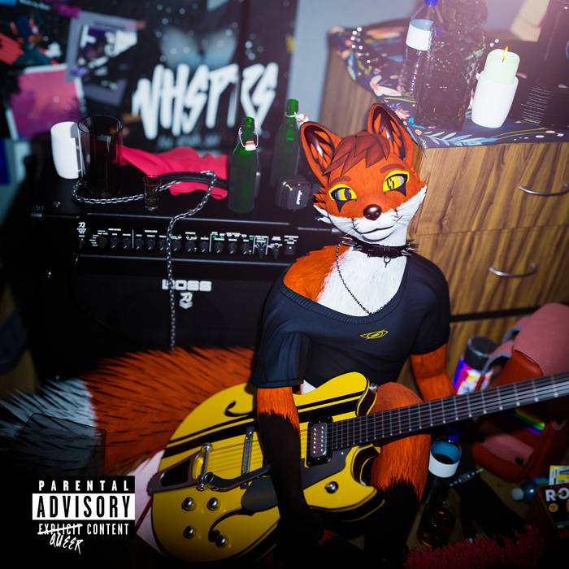

**Whsprs** or simply pronounced as Whispers is an Austrian musician and writer.

<iframe style="border-radius:12px" src="https://open.spotify.com/embed/track/6Znko1vwkXU7ebLmQ0Nl4E?utm_source=generator&theme=0" width="100%" height="152" frameBorder="0" allowfullscreen="" allow="autoplay; clipboard-write; encrypted-media; fullscreen; picture-in-picture" loading="lazy"></iframe> 

> Since November 2021, Whsprs is a regular attendee at the virtual Furality Online Xperience convention on VRChat. He performed live gigs at every convention since Legends. 
>
> In June 2023, he was a featured guest at Furality Sylva on a "Furry Musicians: From Hobby to Career" panel hosted by ChaoticCanineCulture (CK9C), alongside Chi-Chi, Sal, The Stupendium and When Snakes Sing.
>
> In November, Whsprs served as music producer and a guitarist for Bardic RJ's debut single "Candlelight".
>
> -- WikiFur

